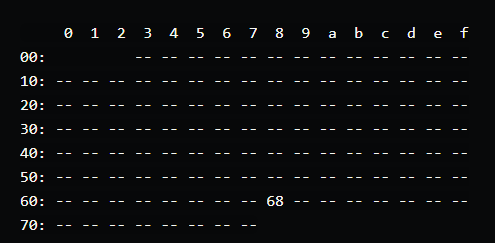
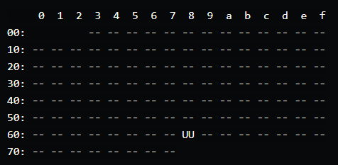

## Componen

DS3231 RTC Modules


## Update OS

`sudo apt update`
`sudo apt upgrade`

## enable I2c interface in raspberry

`sudo raspi-config`

enable i2c interface from raspi-config menu

`sudo reboot`

## install i2c tools

`sudo apt install python3-smbus i2c-tools`

detect rtc module :

`sudo i2cdetect -y 1`



if the rtc module detected it will display of module ID (#68)

## load kernel module of rtc module

`sudo nano /boot/config.txt`

add this line to the end of file:

`dtoverlay=i2c-rtc,ds3231`

`sudo reboot`

## check if kernel module loaded

`sudo i2cdetect -y 1`



if kernel successfully loaded it will show UU

## remove fake-hwclock

`sudo apt-y remove fake-hwclock`
`sudo update-rc.d -f fake-hwclock remove`

## edit hwclock script

`sudo nano /lib/udev/hwclock-set`

change the line :
```
if [ -e /run/systemd/system ] ; then
    exit 0
fi
```
change to :

```
#if [ -e /run/systemd/system ] ; then
#    exit 0
#fi
```

## sync time from pi to RTC module

`sudo hwclock -D -r`

check the raspy time:

`date`

if the time correct write the time to rtc module

`sudo hwclock -w`

check the rtc module time :

`sudo hwclock -r`